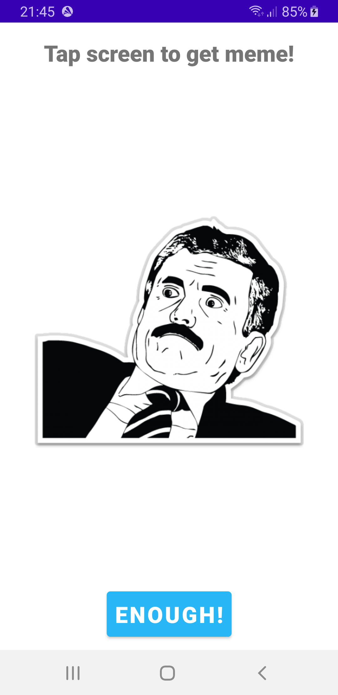
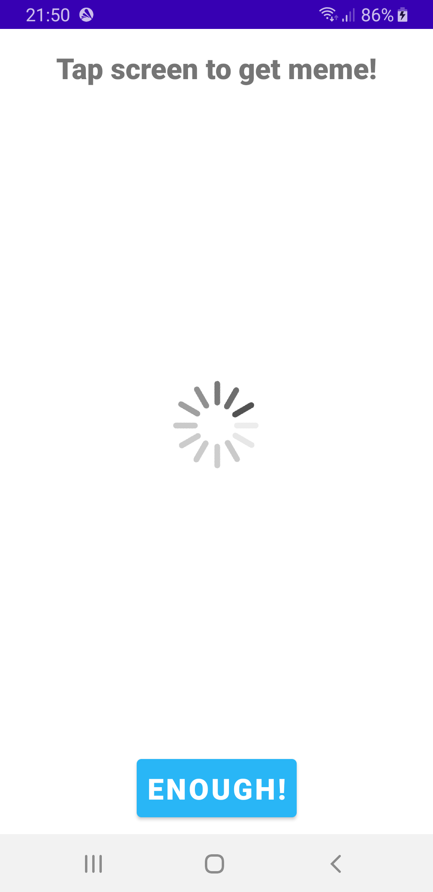
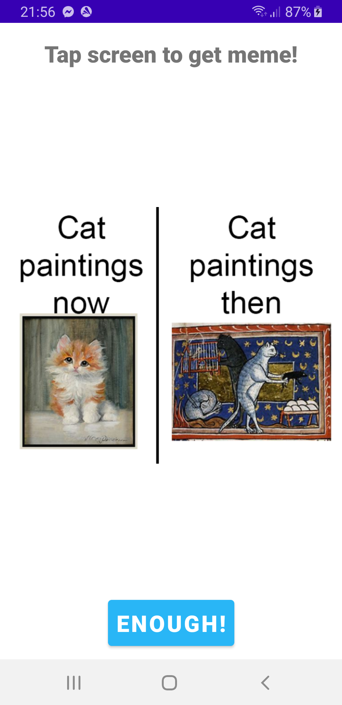
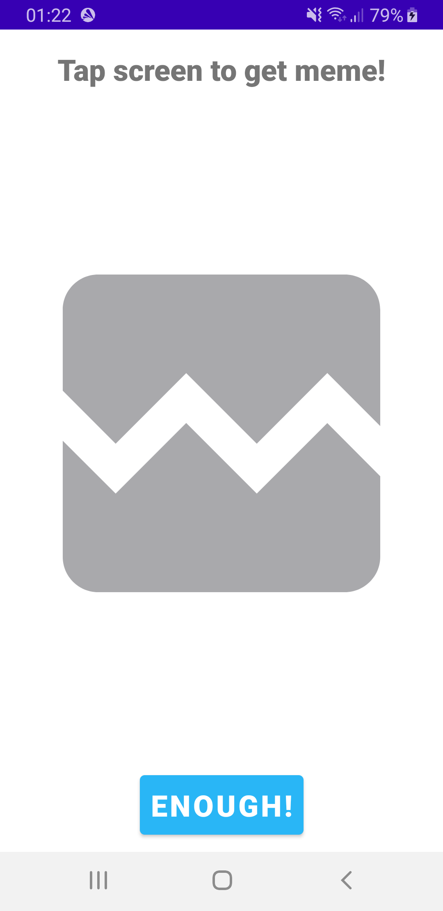
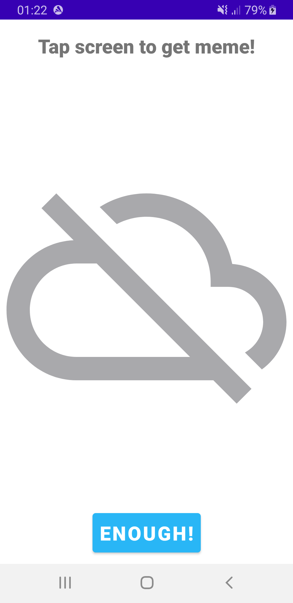

# Gimme Meme! App

Gimme Meme is an Android application developed for a freelance order. This app
is designed to generate random memes from an external API,
providing an engaging and entertaining user experience.

App is designed for:
- Minimum SDK Version: Android 8.0 (Oreo, API level 26).
- Android Version Targeted: Android 13 (API level 33).

## Screenshots

## Features

- Intuitive UI: Simply tap the screen to instantly get a random meme!
- Informational TextView: A prominent message at the top of the main screen guides users what to do 
to get meme.
- Dynamic Image Views: Two image views are thoughtfully designed and stacked to display the current
fetched meme image, loading animation or error image.
- Seamless Exit: For user convenience, a dedicated "ENOUGH!" button is positioned at the bottom of
the screen, allowing users to gracefully exit the app whenever they desire.

## Error Handling

- If the user taps the screen to get a meme but loses internet connection or doesn't turn it on
before running the app, a crossed cloud image will be displayed to inform about the offline error.
- Some of the memes from the internet could be private or may no longer exist. In the event of
attempting to display such an empty picture, a broken image will be shown to inform about the
unreachable meme error.
- In case of any unexpected errors, the user will be informed by an exclamation mark displayed
within a stop sign-shaped image.

# Installation

To run the Cup Calculator project, follow these steps:

1. Clone the repository git clone:
[Repo adress](https://github.com/your-username/GimmeMeme.git) or Download ZIP file and repack
on your disc.
2. Open the project in Android Studio by clicking File in upper left corner of the main screen ->
Open -> Mark repacked file by clicking it once -> click OK.
3. Build and run the project on an emulator or a physical device with Android 8.0 or higher.

## Usage

1. Launch the Gimme Meme! app on your Android device, and indulge yourself in the meme-verse.
2. On the main screen, you will be greeted with an inviting message displayed prominently in the
TextView: "Tap the screen to get a meme!"
3. To obtain a random meme, simply tap on the screen. The app seamlessly communicates with the
powerful REST server at [Adress](https://meme-api.com/gimme) to fetch and present you with an meme
every time. Since memes are generated randomly, it is possible to receive a meme that has been
displayed before.
4. In situations where the internet connection is unavailable or the requested meme is marked
private or empty, a visually engaging crossed cloud image will elegantly substitute the meme,
ensuring a smooth user experience.
5. During the retrieval process, a visually appealing loading animation will keep you engaged
until the next meme is ready to be unveiled.
6. Should you desire to exit the app, a dedicated "ENOUGH!" button is thoughtfully positioned at
the bottom of the screen, providing a satisfying and seamless exit experience.

## Testing

The Meme project includes integration and unit tests.
To run the tests, you can use the testing frameworks provided by Android Studio.

## Technology and Libraries Used

- Android SDK
- Kotlin Language
- XML UI
- Testing: JUnit 4, Mockito, Espresso
- Data Binding with Binding Adapters
- Coroutines (ViewModelScope)
- Retrofit
- Moshi
- REST/HTTP API

## Terms of use

Feel free to download, copy and further customize the content and adapt it to your specific project.
If you have any more questions or need further assistance, feel free to ask!